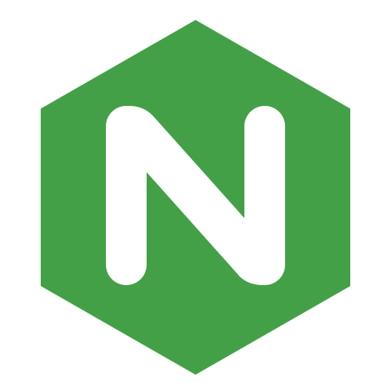

## こんにちは, My name is Syberslxt
👋 I am a Versitile hobbiest that love to tinker with cool tools be it for fun or to make my workflow easier.

👀 My current hobby/learning experiance is homelabs and self-hosting.

## Favorite Tools
<table>
  <tr>
    <td align="center" width="96">
      
       C#
    </td>
    <td align="center" width="96">
      
       JavaScript
    </td>
    <td align="center" width="96">
      
       Bootstrap
    </td>
    <td align="center" width="96">
      
       Docker
    </td>
    <td align="center" width="96">
      
       Arch
    </td>
    <td align="center" width="96">
      
       MySQL
    </td>
    <td align="center" width="96">
      
       Portainer
    </td>
    <td align="center" width="96">
      
       Nginx
    </td>
    <td align="center" width="96">
      
       Node.JS
    </td>
  </tr>
</table>

📫 You could always send me a message if you would like to ask me anything.
